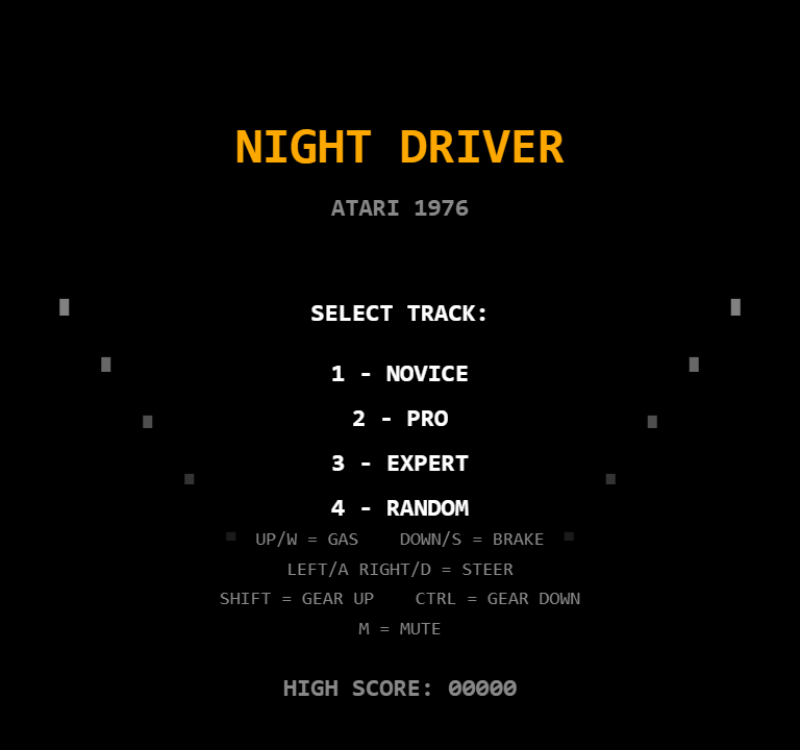
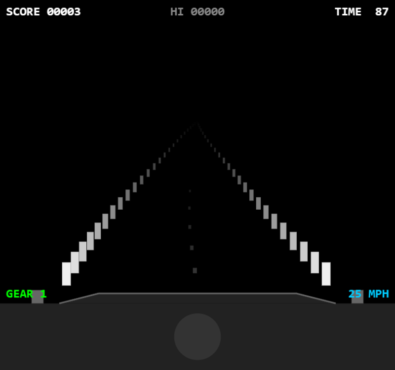
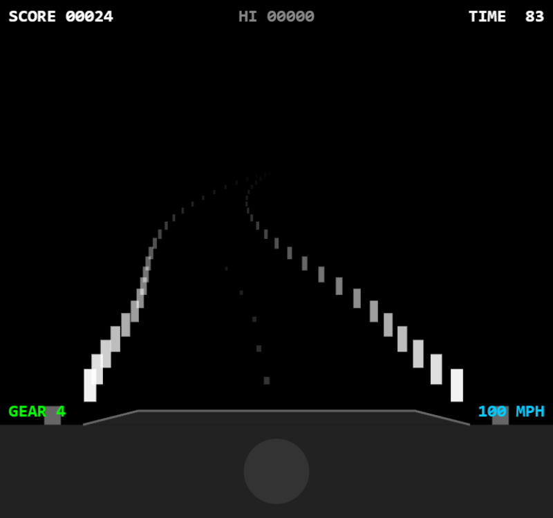

# Night Driver

A faithful TypeScript recreation of Atari's **Night Driver** (1976), the pioneering first-person racing game designed by Dave Shepperd.

Built with Canvas 2D and Web Audio API — zero runtime dependencies, no sprite sheets, no audio files. All graphics and sounds are generated procedurally.

<p align="center">
  
  
  
</p>

## Play

```bash
npm install
npm run dev
```

Open http://localhost:5173 in your browser.

## Controls

| Key | Action |
|-----|--------|
| Up Arrow (or W) | Accelerate (gas) |
| Down Arrow (or S) | Brake |
| Left/Right Arrow (or A/D) | Steer |
| Shift | Gear up |
| Ctrl | Gear down |
| M | Toggle mute |

## Gameplay

You drive at night on a dark road, guided only by white posts marking the road edges. The game is timer-based — you have 90 seconds to score as many points as possible by driving as far and fast as you can.

### Tracks

- **1 - NOVICE** — Gentle curves, easy to follow
- **2 - PRO** — Moderate curves, requires anticipation
- **3 - EXPERT** — Sharp curves, demanding reflexes
- **4 - RANDOM** — Procedurally generated, unpredictable

### Mechanics

- **4-gear system** — Shift up to go faster; each gear has a speed ceiling
- **No lives** — Crashing into road posts doesn't end the game but costs 3 seconds
- **Centrifugal force** — Curves push your car outward; steer to compensate
- **Bonus time** — Earn 30 extra seconds at 300 points
- **Scoring** — 1 point per road segment passed

### Features

- **Pseudo-3D road** — Segment-based perspective with white post pairs on black
- **4 track difficulties** — Novice through Expert plus Random
- **Dashboard silhouette** — Car hood, steering wheel, and side mirrors
- **Engine sound** — Sawtooth drone with pitch mapped to speed
- **Crash effects** — Screen flash, deceleration, tire screech
- **Gear shifting** — Audible click with 4-speed transmission
- **High score persistence** — Saved to localStorage

## Architecture

| Module | Purpose |
|--------|---------|
| `src/game.ts` | Main orchestrator — FSM states, car physics, timer, scoring |
| `src/road/road.ts` | Procedural track generation with curvature segments |
| `src/rendering/renderer.ts` | Pseudo-3D road posts, dashboard, HUD, attract/game over |
| `src/systems/sound.ts` | Web Audio procedural synthesis — engine, crash, skid, gear shift |
| `src/states/` | Generic FSM: Attract, GetReady, Playing, GameOver |

### Technical Highlights

- **Scanline pseudo-3D** — Quadratic depth scaling produces natural perspective convergence
- **Accumulated curvature** — Road curves emerge from per-segment curvature values summed along the view
- **4-gear transmission** — Each gear has independent max speed and acceleration rate
- **Procedural track generation** — Curves transition smoothly with configurable difficulty
- **Engine drone** — Sawtooth oscillator with frequency and gain mapped to speed (40–180 Hz)
- **Fixed-timestep accumulator** — Physics locked at 60 FPS, rendering at display refresh rate
- **3x render scale** — 768x720 canvas (256x240 native)

## History

Night Driver was released by Atari in October 1976, designed by Dave Shepperd. It was one of the first first-person driving games ever made, predating even Atari's own Pole Position by six years. The original hardware used a Motorola 6502 CPU and rendered only 8 pairs of white square posts against a pure black background — the "night" setting was a clever way to avoid rendering complex scenery with the limited hardware of the era.

The game featured three difficulty tracks stored in ROM (Novice, Pro, Expert) plus a procedurally generated random track. Players used a steering wheel and 4-position gear shift lever. The timer-based scoring system — where crashes cost time rather than lives — was unusual for its era and kept players engaged.

Night Driver was also notable for including a physical car dashboard overlay on the arcade cabinet, giving the illusion of sitting inside a car. The game was later ported to the Atari 2600 in 1978, making it one of the earliest home console racing games.

## Build

```bash
npm run build     # TypeScript compile + Vite bundle to /dist
npm run preview   # Preview production build
```

## License

MIT
